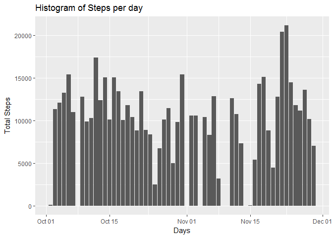
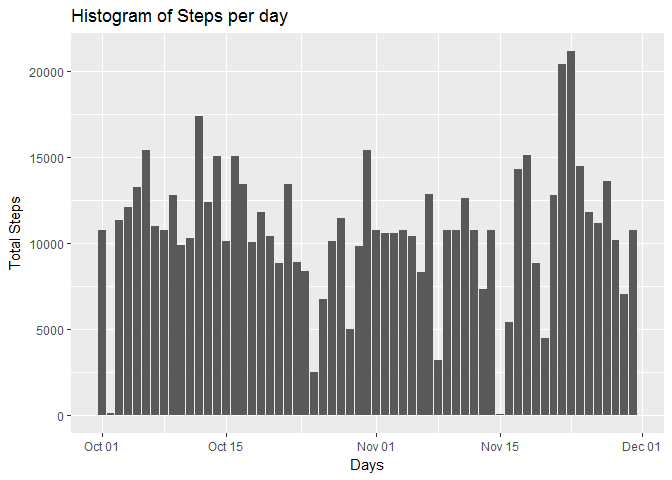

# Project Assignment 1 - Reproducible Research


```r
library(ggplot2)
library(lubridate)
```

##Loading and Preprocessing the Data##
###Load the Data###

```r
activity <- read.csv("activity.csv", header = TRUE, sep = ',', 
                     colClasses = c("numeric", "character", "integer"))
```
###Change the date column to dateformat from string ###

```r
activity$date <- ymd(activity$date)
```
###Check the structure of the data ###


```r
str(activity)
```

```
## 'data.frame':	17568 obs. of  3 variables:
##  $ steps   : num  NA NA NA NA NA NA NA NA NA NA ...
##  $ date    : Date, format: "2012-10-01" "2012-10-01" ...
##  $ interval: int  0 5 10 15 20 25 30 35 40 45 ...
```
##What is mean total number of steps taken per day?##
###Calculate the total number of steps taken per day###

```r
stepsByDay <- aggregate(activity$steps ~ activity$date, FUN=sum, na.action = na.omit)
colnames(stepsByDay)<- c("Date", "Steps")
```
###Make a histogram of the total number of steps taken each day###

```r
ggplot(stepsByDay,aes(x=Date,y=Steps))+geom_bar(stat="identity") +
  labs(title = "Histogram of Steps per day", x = "Days", y = "Total Steps")
```

<!-- -->

###Calculate and report the mean and median of the total number of steps taken per day###

```r
mean(stepsByDay$Steps)
```

```
## [1] 10766.19
```

```r
median(stepsByDay$Steps)
```

```
## [1] 10765
```
##What is the average daily activity pattern?##
###Calculate average number of steps per interval###

```r
averageStepsPerInterval <- aggregate(x=list(meanSteps=activity$steps), by=list(interval=activity$interval), FUN=mean, na.rm=TRUE)
```
###Time Series Plot###

```r
ggplot(data=averageStepsPerInterval, aes(x=interval, y=meanSteps)) +
    geom_line() +
    xlab("5-minute interval") +
    ylab("average number of steps taken") 
```

<!-- -->

###Which 5-minute interval, on average contains the maximum number of steps?###

```r
averageStepsPerInterval[which.max(averageStepsPerInterval$meanSteps),]
```

```
##     interval meanSteps
## 104      835  206.1698
```
##Imputing Missing Values##
###Calculate and report the total number of missing values in the dataset###

```r
sum(is.na(activity$steps))
```

```
## [1] 2304
```

###Devise a strategy for filling in all of the missing values in the dataset.###

#### Fill the Missing Values with Average number of steps per 5 minute interval####

```r
newActivityData <- activity
navalues <- is.na(newActivityData$steps)
avginterval <- tapply(newActivityData$steps, newActivityData$interval, mean, na.rm=TRUE, simplify=TRUE)
newActivityData$steps[navalues] <- avginterval[as.character(newActivityData$interval[navalues])]
```
##### There are no Missing Values in the new Dataset#####

```r
sum(is.na(newActivityData$steps))
```

```
## [1] 0
```

#### Make a histogram of the total number of steps taken each day and Calculate and report the mean and median total number of steps taken per day. Do these values differ from the estimates from the first part of the assignment? What is the impact of imputing missing data on the estimates of the total daily number of steps?####


```r
stepsByDayNew <- aggregate(newActivityData$steps ~ newActivityData$date, FUN=sum, na.action = na.omit)
colnames(stepsByDayNew)<- c("Date", "Steps")
```
####Make a histogram of the total number of steps taken each day for the new data####

```r
ggplot(stepsByDayNew,aes(x=Date,y=Steps))+geom_bar(stat="identity") +
  labs(title = "Histogram of Steps per day", x = "Days", y = "Total Steps")
```

<!-- -->

####Calculate and report the mean and median of the total number of steps taken per day for the new data####

```r
mean(stepsByDayNew$Steps)
```

```
## [1] 10766.19
```

```r
median(stepsByDayNew$Steps)
```

```
## [1] 10766.19
```

The impact of imputing missing data with the average number of steps in the same 5-min interval is that both the mean and the median are equal to the same value: 10766.19

###Are there differences in activity patterns between weekdays and weekends?###
####Create a new Factor Variable indicating weekdays and weekends?####

```r
newActivityData$DayCategory <- ifelse(weekdays(newActivityData$date) %in% c("Saturday", "Sunday"), "Weekend", "Weekday")
head(newActivityData)
```

```
##       steps       date interval DayCategory
## 1 1.7169811 2012-10-01        0     Weekday
## 2 0.3396226 2012-10-01        5     Weekday
## 3 0.1320755 2012-10-01       10     Weekday
## 4 0.1509434 2012-10-01       15     Weekday
## 5 0.0754717 2012-10-01       20     Weekday
## 6 2.0943396 2012-10-01       25     Weekday
```

Make a panel plot containing a time series plot


```r
averagedActivityData <- aggregate(steps ~ interval + DayCategory, data=newActivityData, mean)
ggplot(averagedActivityData, aes(interval, steps)) + 
    geom_line() + 
    facet_grid(DayCategory ~ .) +
    xlab("5-minute interval") + 
    ylab("avarage number of steps")
```

<!-- -->

The steps are different in weekdays as compared to weekends probably due to the reeason that 
people work on weekdays.
